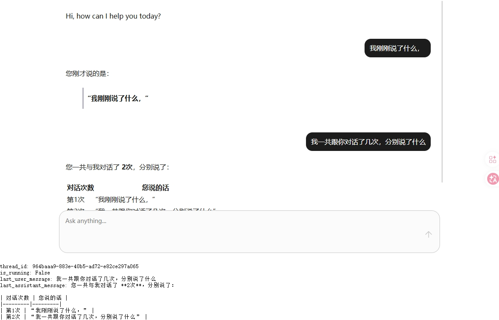

# nokiao_copilot_chat

一个面向 Agno AG-UI 集成的 CopilotKit Chat UI Dash 组件封装。



## 功能特性

- Dash 组件：`NokiaoCopilotChat`
- 通过 AG-UI 接口（`agui_url`）驱动的纯前端聊天
- 用于 Dash 状态同步的回调桥接属性：
  `thread_id`, `last_user_message`, `last_assistant_message`, `is_running`, `event_seq`
- 内置实用 UI 调整（固定高度聊天区、代码块工具栏优化）

## 安装

```bash
pip install nokiao_copilot_chat
```

## 快速开始

1. 启动 AG-UI 服务：

```bash
python agent_os.py
```

2. 运行 Dash 示例：

```bash
python usage.py
```

## 最小示例

```python
import dash
from dash import html
import nokiao_copilot_chat as ncc

app = dash.Dash(__name__)

app.layout = html.Div(
    [
        ncc.NokiaoCopilotChat(
            id="copilot-chat",
            agent="Assistant",
            agui_url="http://localhost:8000/agui",
            headers={"Authorization": "Bearer <YOUR_TOKEN>"},
            labels={
                "initial": "Hi, how can I help you today?",
                "placeholder": "Ask anything...",
            },
            style={"maxWidth": "920px", "margin": "24px auto", "height": "600px"},
        ),
    ]
)

if __name__ == "__main__":
    app.run(debug=True)
```

## Dash 回调桥接

推荐使用 `event_seq` 作为回调触发器，其它属性用于读取最新状态快照。

```python
@app.callback(
    Output("chat-state", "children"),
    Input("copilot-chat", "event_seq"),
    [
        State("copilot-chat", "thread_id"),
        State("copilot-chat", "last_user_message"),
        State("copilot-chat", "last_assistant_message"),
        State("copilot-chat", "is_running"),
    ],
)
def show_bridge_state(_, thread_id, last_user, last_assistant, is_running):
    return (
        f"thread_id: {thread_id}\n"
        f"is_running: {is_running}\n"
        f"last_user_message: {last_user}\n"
        f"last_assistant_message: {last_assistant}"
    )
```

## 当前运行拓扑

当前组件 API 直接暴露 `agui_url`（AG-UI 端点）。

```text
Dash frontend -> Agno AG-UI endpoint (/agui)
```

## 开发指南

### 环境准备

1. 创建虚拟环境：

```bash
python -m venv venv
```

Windows：

```bash
venv\Scripts\activate
```

macOS/Linux：

```bash
source venv/bin/activate
```

2. 安装依赖：

```bash
pip install -r requirements.txt
npm install
```

3. 构建：

```bash
npm run build
```

### 常用命令

```bash
npm run build:js::dev
npm run build:js
npm run build:backends
npm run dist
```

### 发布

构建发布产物：

```bash
npm run dist
```

上传到 PyPI：

```bash
twine upload dist/*
```

## Justfile

如果你使用 `just`：

```bash
just install
just build
just publish
just -l
```
